# Context

This document defines the architecture for integrating dedicated BTP audit logging infrastructure with Kyma Runtime provisioning via the Kyma Audit Log Manager (KALM).

# Status

Proposed

# Background

Currently, Kyma Runtimes use a shared audit logging infrastructure where multiple runtimes share common audit log tenants, configured via a static mapping file that maps provider type and region to tenant IDs. This approach has limitations:

- **No self-service access**: Users cannot directly access their audit logs without SRE assistance
- **Shared infrastructure**: Multiple runtimes share the same audit logging tenant
- **Static configuration**: Audit log configuration is managed via static file updates

The Kyma Audit Log Manager (KALM) introduces a pool-based approach for provisioning dedicated BTP audit logging infrastructure per runtime. KALM runs as part of the Kyma Control Plane and manages the complete lifecycle of dedicated audit log stacks through the `AuditLog` custom resource.

## KALM Pool Architecture

KALM maintains a pool of pre-provisioned `AuditLog` CRs in the `SiemApproved` state. These CRs contain:
- BTP subaccount with audit log service provisioned
- Service credentials stored in Gardener secrets
- SIEM registration completed
- Ready to be assigned to a Kyma Runtime

Key KALM states:
- `Pending`: Initial state, BTP resources being provisioned
- `RegistrationReady`: BTP resources ready, awaiting SIEM registration
- `SiemApproved`: In the pool, ready for assignment
- `Assigned`: Claimed by a runtime, in use
- `Orphaned`: Runtime deleted, in retention period (default: 90 days)

# Decision

## Architectural Approach

We implement a **validation-first, migrate-last provisioning model** where dedicated audit logging availability is validated before shoot creation, the shoot is created with shared audit logging, the entire provisioning completes successfully, and only then is the runtime migrated to dedicated logging as the final step.

### FSM State Flow

```
sFnCreateShoot (validates dedicated config availability if requested)
    ↓
sFnWaitForShootCreation
    ↓
sFnHandleKubeconfig
    ↓
sFnCreateKymaNamespace
    ↓
sFnInitializeRuntimeBootstrapper
    ↓
sFnCleanupRegistryCacheGardenSecrets
    ↓
sFnConfigureSKR
    ↓
sFnApplyClusterRoleBindings
    ↓
sFnMigrateToDedicatedAuditLog  (new state - absolute final step)
    ↓
Complete (updateStatusAndStop)
```

**Note**: After `sFnMigrateToDedicatedAuditLog` patches the shoot with dedicated config, it requeues the reconciliation. On the next reconciliation, the state will be skipped (because the shoot already has dedicated logging configured), and provisioning completes successfully.

### Sequence Diagram

```mermaid
sequenceDiagram
    participant KEB as Kyma Environment Broker
    participant KIM as Infrastructure Manager (FSM)
    participant Gardener as Gardener API
    participant KALM as Audit Log Pool (KALM)
    participant K8s as Kubernetes API

    KEB->>KIM: Create Runtime CR
    
    Note over KIM: sFnCreateShoot<br/>(Phase 1: Reserve)
    alt Dedicated audit logging requested
        KIM->>K8s: List AuditLog CRs<br/>(label: reserved-for-runtime-id = runtimeID)
        alt Existing reservation found
            K8s-->>KIM: Return reserved AuditLogCR
        else No existing reservation
            KIM->>K8s: List AuditLog CRs<br/>(state = SiemApproved, unassigned, no reservation)
            alt Available CR found
                K8s-->>KIM: Return available AuditLogCR
                KIM->>K8s: Add labels:<br/>reserved-for-runtime-id: <runtimeID><br/>reserved-for-runtime-at: <timestamp>
                alt Reservation successful
                    K8s-->>KIM: Reservation success (light lock)
                else Conflict (concurrent reservation)
                    K8s-->>KIM: Conflict error
                    Note over KIM: Retry with different CR
                end
            else No available CR
                Note over KIM: Fail provisioning immediately
                KIM-->>KEB: Provisioning failed: no audit log available
            end
        end
    end
    
    KIM->>KIM: Load shared audit log config<br/>(from static mapping file)
    KIM->>Gardener: Create Shoot with shared audit logging
    Gardener-->>KIM: Shoot created
    
    Note over KIM: sFnWaitForShootCreation
    KIM->>Gardener: Poll shoot status
    Gardener-->>KIM: Shoot creation succeeded
    
    Note over KIM: ... Full provisioning flow ...
    Note over KIM: sFnConfigureSKR
    KIM->>KIM: Configure SKR
    
    Note over KIM: sFnApplyClusterRoleBindings
    KIM->>KIM: Apply cluster role bindings
    
    Note over KIM: sFnMigrateToDedicatedAuditLog<br/>(Phase 2: Claim - final step)
    alt Feature flag enabled
        KIM->>KIM: Check if already using dedicated config
        alt Not using dedicated yet
            KIM->>K8s: List AuditLog CRs<br/>(label: reserved-for-runtime-id = runtimeID)
            alt Reserved CR found
                K8s-->>KIM: Return reserved AuditLogCR
                KIM->>K8s: Set assignedToRuntimeID = runtimeID<br/>(upgrade to heavy lock)
                alt Claim successful
                    K8s-->>KIM: Claim success
                else Conflict
                    K8s-->>KIM: Conflict error
                    Note over KIM: Requeue, retry claim
                end
            else Reservation not found
                Note over KIM: Fail provisioning:<br/>reserved CR missing
            end
            KIM->>KIM: Extract config from AuditLogCR
            KIM->>Gardener: PATCH Shoot with dedicated config
            alt Update successful
                Gardener-->>KIM: Shoot patched
                Note over KIM: Requeue reconciliation
            else Update failed
                Gardener-->>KIM: Error
                Note over KIM: Requeue, will retry<br/>(AuditLogCR stays claimed)
            end
        else Already using dedicated
            Note over KIM: Complete provisioning
        end
    else Feature flag disabled
        Note over KIM: Complete provisioning with shared logging
    end
    
    Note over KIM: sFnMigrateToDedicatedAuditLog<br/>(next reconciliation)
    KIM->>KIM: Check if already using dedicated config
    Note over KIM: Already migrated, complete provisioning
    
    KIM->>KEB: Update Runtime CR status<br/>(Provisioning Completed)
    
    Note over KIM,Gardener: ... Runtime operational ...
    
    KEB->>KIM: Delete Runtime CR
    Note over KIM: sFnDeleteShoot
    alt Dedicated logging was used
        KIM->>K8s: Update AuditLogCR.orphaned = true
        K8s-->>KIM: Marked as orphaned
        Note over KALM: KALM handles retention<br/>and cleanup (90 days)
    end
    KIM->>Gardener: Delete Shoot
    Gardener-->>KIM: Shoot deleted
```



### Phase 1: Validate and Create Shoot with Shared Audit Logging

The `sFnCreateShoot` state first validates that dedicated audit logging configuration is available (if requested), then creates the Gardener shoot using the existing shared audit log configuration from the static mapping file.

**Validation**: If the runtime requests dedicated audit logging (`auditLogAccessEnabled: true`) and the global feature flag is enabled, the state checks that a dedicated AuditLogCR is available in the pool. If not available, provisioning fails immediately.

**Rationale for validation-first approach**:
- Fail fast: Don't waste time and resources provisioning a runtime if dedicated logging cannot be provided as requested
- Clear error: User gets immediate feedback that their request cannot be fulfilled
- No orphaned resources: Shoot is never created if dedicated logging requirement cannot be met

**Rationale for using shared logging initially**:
- Allows shoot to be created and tested before claiming expensive dedicated resources
- If the shoot fails for other reasons (quota, config, infrastructure), no dedicated resources are wasted

### Phase 2: Complete Provisioning

The runtime goes through the full provisioning flow:
- `sFnWaitForShootCreation` - Wait for shoot to be ready
- `sFnHandleKubeconfig` - Handle kubeconfig
- `sFnCreateKymaNamespace` - Create Kyma namespace
- `sFnInitializeRuntimeBootstrapper` - Initialize bootstrapper
- `sFnCleanupRegistryCacheGardenSecrets` - Cleanup secrets
- `sFnConfigureSKR` - Configure SKR
- `sFnApplyClusterRoleBindings` - Apply cluster role bindings

All these steps complete successfully before any dedicated audit logging resources are claimed.

### Phase 3: Migrate to Dedicated Audit Logging (Final Step)

After **all provisioning is complete**, the `sFnMigrateToDedicatedAuditLog` state executes as the absolute final step. This state uses an optimized order of operations to minimize side effects and handle errors gracefully:

**Step 1: Get Reserved Audit Log Data** (read-only, no side effects)
- Retrieves configuration from the reserved AuditLogCR (using reservation label)
- Fails immediately if no reservation found
- No resources claimed yet - safe to fail

**Step 2: Get Current Shoot Configuration** (read-only, no side effects)
- Extracts current audit log config from shoot's extension
- Compares with desired configuration
- Determines if patch is needed

**Step 3: Confirm Reservation** (upgrade light lock to heavy lock)
- Calls `ConfirmReservation(runtimeID)` to upgrade reservation to claim
- Sets `AuditLog.Spec.AssignedToRuntimeID = runtimeID` (heavy lock)
- **Always happens**, even if configs are equal (ensures reservation is confirmed)
- Idempotent: safe to retry if already claimed
- Fails provisioning if reservation cannot be confirmed

**Step 4: Conditional Patch** (only if configurations differ)
- If configs are equal: Skip patch, complete provisioning immediately
- If configs differ: Patch shoot with dedicated audit log configuration
- Uses values from `AuditLog.Spec.Config.ServiceURL` and `AuditLog.Spec.Config.GardenerSecretName`
- If patch fails: Requeue (claim persists, retry patch on next reconciliation)

**Step 5: Complete Provisioning**
- Sets `ProvisioningCompleted` status
- Returns `updateStatusAndStop()` (no explicit requeue)
- Gardener shoot reconciliation will trigger Runtime reconciliation if needed

**Key Properties**:
- **Read-only operations first**: No side effects until commit point (claim)
- **Always confirms claim**: Even when configs equal, ensuring reservation is locked
- **Idempotent at every step**: Safe to retry from any failure point
- **Efficient**: Skips unnecessary patches when configs already match
- **Clean completion**: No unnecessary requeues after success
- **Atomic claim**: Once claimed, resource is locked even if patch fails
- **Optimistic concurrency**: Kubernetes resourceVersion prevents double-claiming

## Rejected Alternatives

### Alternative 1: Single-Phase Claim (Validate Only, No Reservation)

**Approach**: Validate availability in `sFnCreateShoot`, claim in `sFnMigrateToDedicatedAuditLog` without reservation

**Rejected because**:
- Race condition: Between validation and claim (~5-10 minutes), another runtime could take the resource
- User gets false positive: Validation succeeds but migration fails
- Poor user experience: Provisioning fails at the very end after all resources created
- Wastes shoot resources: Entire shoot is created then has to be torn down

### Alternative 2: Claim Before Shoot Creation (Heavy Lock First)

**Approach**: Claim AuditLogCR → Create shoot with dedicated config

**Rejected because**:
- If shoot creation fails (quota exceeded, invalid config), the claimed AuditLogCR is wasted
- The AuditLogCR remains locked to a non-existent runtime
- Pool resources are depleted unnecessarily
- Requires complex rollback logic

### Alternative 2: Claim and Create Atomically

**Approach**: Claim AuditLogCR and create shoot in a single transaction, with rollback on failure

**Rejected because**:
- Kubernetes doesn't support cross-resource transactions
- Rollback logic is complex and error-prone
- Shoot creation can fail at various stages (Gardener API, infrastructure provider)
- Still risks wasting resources during transient failures

### Alternative 3: Lock-Based Claiming

**Approach**: Add lock fields to AuditLog CR spec for claiming

**Rejected because**:
- Adds unnecessary complexity to the CRD
- Kubernetes optimistic concurrency (resourceVersion) already prevents double-claiming
- Locks can become stale if client crashes
- Requires lock cleanup/timeout logic

## Implementation Details

### AuditLog Data Provider

All audit log operations are abstracted behind the `auditlog.DataProvider` interface:

```go
type DataProvider interface {
    // Returns audit log data from dedicated or shared config
    GetAuditLogData(ctx, providerType, region, runtimeID, useDedicated) (AuditLogData, error)
    
    // Checks if runtime is using dedicated logging
    IsDedicated(ctx, runtimeID) (bool, error)
    
    // Releases dedicated AuditLogCR (marks as orphaned)
    ReleaseDedicated(ctx, runtimeID) error
}
```

**Benefits**:
- FSM doesn't need to know about claiming logic
- Easy to mock for testing
- Shared vs dedicated decision is encapsulated
- Graceful fallback to shared config is transparent

### Claiming Algorithm: Two-Phase Reservation

The claiming algorithm uses a **two-phase approach** to solve the race condition between validation (pre-creation) and actual claiming (post-provisioning):

#### Problem Statement

Between the time we validate that an AuditLogCR is available (in `sFnCreateShoot`) and when we actually claim it (in `sFnMigrateToDedicatedAuditLog` ~5-10 minutes later), another runtime could claim that resource. This would cause the migration to fail even though validation passed.

#### Solution: Label-Based Reservation (Light Lock)

We use Kubernetes labels as a "light lock" mechanism to reserve an AuditLogCR during the provisioning window:

**Phase 1: Reserve (in `sFnCreateShoot`)**
```go
func reserveAuditLogCR(ctx, runtimeID) (*AuditLog, error) {
    // 1. Check if we already have a reservation
    reserved := findAuditLogCRByLabel(ctx, "reserved-for-runtime-id", runtimeID)
    if reserved != nil {
        return reserved, nil // Already reserved for us
    }
    
    // 2. Find available CR (state = SiemApproved, assignedToRuntimeID = "", no reservation label)
    available := findAvailableAuditLogCR(ctx)
    if available == nil {
        return nil, ErrNoAvailableAuditLog
    }
    
    // 3. Add reservation labels (light lock)
    if available.Labels == nil {
        available.Labels = make(map[string]string)
    }
    available.Labels["reserved-for-runtime-id"] = runtimeID
    available.Labels["reserved-for-runtime-at"] = time.Now().UTC().Format(time.RFC3339)
    
    // 4. Update with optimistic concurrency
    err := client.Update(ctx, available)
    if IsConflict(err) {
        // Another runtime reserved it concurrently, retry with different CR
        return nil, ErrConflictReserving
    }
    
    return available, nil
}
```

**Phase 2: Claim (in `sFnMigrateToDedicatedAuditLog`)**
```go
func claimReservedAuditLogCR(ctx, runtimeID) (*AuditLog, error) {
    // 1. Find our reserved CR
    reserved := findAuditLogCRByLabel(ctx, "reserved-for-runtime-id", runtimeID)
    if reserved == nil {
        return nil, ErrReservationNotFound
    }
    
    // 2. Check if already claimed (idempotent)
    if reserved.Spec.AssignedToRuntimeID == runtimeID {
        return reserved, nil // Already claimed by us
    }
    
    // 3. Upgrade reservation to full claim (heavy lock)
    reserved.Spec.AssignedToRuntimeID = runtimeID
    
    // 4. Update with optimistic concurrency
    err := client.Update(ctx, reserved)
    if IsConflict(err) {
        // Unlikely but possible, retry
        return nil, ErrConflictClaiming
    }
    
    return reserved, nil
}
```

#### Reservation Labels

Two labels are added to the AuditLogCR during reservation:

- **`reserved-for-runtime-id`**: The Runtime CR name (e.g., `"1234-5678-90ab-cdef"`)
  - Used to find the reserved resource in Phase 2
  - Identifies which runtime has reserved this CR
  
- **`reserved-for-runtime-at`**: RFC3339 timestamp (e.g., `"2026-06-18T14:30:00Z"`)
  - Records when the reservation was made
  - Enables detection of stale reservations
  - Can be used for automated cleanup of abandoned reservations

#### Resource States

An AuditLogCR can be in one of these states:

1. **Available**: `state=SiemApproved`, `assignedToRuntimeID=""`, no reservation labels
2. **Reserved (Light Lock)**: Has reservation labels, `assignedToRuntimeID=""`
3. **Claimed (Heavy Lock)**: Has reservation labels, `assignedToRuntimeID=<runtimeID>`
4. **Orphaned**: `spec.orphaned=true`, retention period active

#### State Transitions

```
Available → Reserved (by sFnCreateShoot adding labels)
    ↓
Reserved → Claimed (by sFnMigrateToDedicatedAuditLog setting assignedToRuntimeID)
    ↓
Claimed → Orphaned (by sFnDeleteShoot setting orphaned=true)
    ↓
Orphaned → Cleaned up (by KALM after retention period)

Special case:
Reserved → Available (manual label removal if provisioning abandoned)
```

#### Cleanup of Abandoned Reservations

**Manual Cleanup (Recommended for MVP)**:
- Operators can manually remove reservation labels from AuditLogCRs that are reserved but not claimed
- Query: `kubectl get auditlog -l reserved-for-runtime-id,!assignedToRuntimeID`
- This returns resources that are reserved (have label) but never claimed (no assignment)
- Safe to remove labels and return to pool:
  ```bash
  kubectl label auditlog <name> reserved-for-runtime-id- reserved-for-runtime-at-
  ```

**Automated Cleanup (Future Enhancement)**:
A KALM controller or separate cleanup job could automate this:

```go
// Pseudo-code for automated cleanup
func cleanupStaleReservations(ctx) {
    // Find reserved but not claimed CRs
    list := client.List(ctx, &AuditLogList{}, 
        client.MatchingLabels{"reserved-for-runtime-id": "*"},
        client.MatchingFields{"spec.assignedToRuntimeID": ""})
    
    for _, cr := range list.Items {
        reservedAt, err := time.Parse(time.RFC3339, cr.Labels["reserved-for-runtime-at"])
        if err != nil {
            continue
        }
        
        // If reserved for more than 1 hour without claim, release it
        if time.Since(reservedAt) > 1*time.Hour {
            delete(cr.Labels, "reserved-for-runtime-id")
            delete(cr.Labels, "reserved-for-runtime-at")
            client.Update(ctx, &cr)
            log.Info("Released stale reservation", "auditlog", cr.Name, "reservedFor", 1*time.Hour)
        }
    }
}
```

**Cleanup Parameters**:
- **Timeout threshold**: 1 hour (configurable)
  - Normal provisioning takes 5-15 minutes
  - 1 hour provides generous buffer for retries and delays
  - Prevents indefinite pool exhaustion from failed provisions
- **Cleanup frequency**: Every 30 minutes
- **Safety**: Only removes labels from CRs with `assignedToRuntimeID=""` (never disrupts claimed resources)

#### Why Labels Instead of Spec Fields?

1. **No CRD changes required**: Labels can be added without modifying KALM's AuditLog CRD
2. **Kubernetes-native**: Label selectors are efficient and well-supported
3. **Non-intrusive**: Labels don't affect KALM's state machine or business logic
4. **Easy cleanup**: Labels can be removed without validation or reconciliation
5. **Observable**: `kubectl get auditlog -l reserved-for-runtime-id` shows all reservations

#### Coordination with KALM

KALM should be updated to respect reservations:

1. **Pool Management**: When counting available AuditLogCRs, exclude those with reservation labels:
   ```go
   availableCount := count(state=SiemApproved AND assignedToRuntimeID="" AND no reservation labels)
   ```

2. **State Transitions**: KALM's state machine should ignore reservation labels
   - Labels don't affect `SiemApproved` → `Assigned` transition
   - Only `assignedToRuntimeID` field triggers state change

3. **Cleanup (Optional)**: KALM could run the automated cleanup job described above

#### Key Properties

- **Solves race condition**: Reservation prevents other runtimes from selecting the same CR during provisioning
- **Idempotent**: Both reserve and claim operations can be safely retried
- **Concurrent-safe**: Kubernetes optimistic concurrency prevents double-reservation
- **Fail-fast**: Validation + reservation happens before expensive shoot creation
- **Minimal waste**: If provisioning fails, only a label needs cleanup (not a fully assigned resource)
- **Observable**: Easy to query reserved vs available resources
- **Manual override**: Operators can manually release stale reservations if needed

#### Error Scenarios

| Scenario | Handling |
|----------|----------|
| No available CR to reserve | Fail provisioning immediately in `sFnCreateShoot` |
| Conflict during reservation | Retry with different available CR |
| Reservation not found in Phase 2 | Should never happen if Phase 1 succeeded; fail provisioning with clear error |
| Conflict during claim | Retry claim operation |
| Provisioning fails after reservation | Label remains; cleaned up manually or by automated job |
| Runtime deleted before migration | Label remains; cleaned up manually or by automated job |


### Migration State Implementation

```go
func sFnMigrateToDedicatedAuditLog(ctx context.Context, m *fsm, s *systemState) (stateFn, *ctrl.Result, error) {
    // Check if global feature flag is enabled
    if !m.RCCfg.DedicatedAuditLoggingEnabled {
        return sFnHandleKubeconfig, nil, nil // Global feature flag disabled - skip
    }

    // Check if runtime-specific audit log access is enabled
    // This is set per-runtime in Runtime.Spec.AuditLogAccessEnabled
    if s.instance.Spec.AuditLogAccessEnabled == nil || !*s.instance.Spec.AuditLogAccessEnabled {
        return sFnHandleKubeconfig, nil, nil // Runtime doesn't request audit log access - skip
    }

    // Check if already using dedicated audit logging
    // This check ensures idempotency and prevents re-migration on subsequent reconciliations
    if isUsingDedicatedAuditLog(s.shoot) {
        m.log.Info("Already using dedicated audit logging, skipping migration")
        return sFnHandleKubeconfig, nil, nil
    }

    // Step 1: Get or claim AuditLogCR (idempotent)
    auditLogData, err := m.AuditLogDataProvider.GetAuditLogData(
        ctx,
        s.instance.Spec.Shoot.Provider.Type,
        s.instance.Spec.Shoot.Region,
        s.instance.GetName(),
        true, // use dedicated
    )
    if err != nil {
        // No available AuditLogCR - continue with shared logging
        m.log.Info("No available dedicated audit log, continuing with shared configuration",
            "error", err.Error())
        return sFnHandleKubeconfig, nil, nil
    }

    if !auditLogData.IsDedicated {
        // Provider fell back to shared config
        return sFnHandleKubeconfig, nil, nil
    }

    // Step 2: PATCH shoot with dedicated config (idempotent)
    if err := m.patchShootAuditLog(ctx, s.shoot, auditLogData); err != nil {
        // AuditLogCR is claimed, we'll retry the patch on next reconciliation
        m.log.Error(err, "Failed to patch shoot with dedicated audit log, will retry")
        return updateStatusAndRequeueAfter(m.RCCfg.GardenerRequeueDuration)
    }

    m.log.Info("Successfully patched shoot with dedicated audit logging",
        "runtimeID", s.instance.GetName())

    // Requeue to allow the shoot update to be processed
    // On next reconciliation, isUsingDedicatedAuditLog() will return true and we skip this state
    return updateStatusAndRequeueAfter(m.RCCfg.GardenerRequeueDuration)
}

// isUsingDedicatedAuditLog checks if the shoot is already configured with dedicated audit logging
// This prevents re-migration on subsequent reconciliations by checking for the dedicated audit log label
func isUsingDedicatedAuditLog(shoot *gardener.Shoot) bool {
    if shoot == nil || shoot.Labels == nil {
        return false
    }
    
    // Check if the dedicated audit log label exists and is set to "true"
    value, exists := shoot.Labels[DedicatedAuditLogLabel]
    return exists && value == "true"
}

// patchShootAuditLog patches the shoot with dedicated audit log configuration and adds the label
func patchShootAuditLog(ctx context.Context, m *fsm, s *systemState, auditLogData auditlog.AuditLogData) error {
    patchedShoot := s.shoot.DeepCopy()

    // Ensure labels map exists
    if patchedShoot.Labels == nil {
        patchedShoot.Labels = make(map[string]string)
    }

    // Add dedicated audit log label
    patchedShoot.Labels[DedicatedAuditLogLabel] = "true"

    // Find and update the audit log extension config...
    // (update TenantID, ServiceURL, SecretReferenceName from auditLogData)

    return m.GardenClient.Patch(ctx, patchedShoot, client.MergeFrom(s.shoot))
}
```

**Label-Based Detection**:
- Label: `infrastructuremanager.kyma-project.io/dedicated-auditlog: "true"`
- Simple, reliable check without parsing JSON config
- Label is added during migration and persists on the shoot
- Allows easy filtering/querying of shoots using dedicated logging

**Key behavior**:
- **First reconciliation after shoot creation**: State checks label (not present), claims AuditLogCR, patches shoot with label, requeues
- **Second reconciliation**: State checks label (present), skips immediately to `sFnHandleKubeconfig`
- **Subsequent reconciliations**: Same as second - always skips once migrated


### Cleanup on Runtime Deletion

When a runtime is deleted, the claimed AuditLogCR must be released:

```go
func sFnDeleteShoot(ctx, m *fsm, s *systemState) (stateFn, *ctrl.Result, error) {
    // Release the claimed AuditLogCR if we have one
    if m.RCCfg.DedicatedAuditLoggingEnabled {
        err := m.AuditLogDataProvider.ReleaseDedicated(ctx, s.instance.GetName())
        if err != nil {
            m.log.Error(err, "Failed to release dedicated audit log")
            // Continue with shoot deletion anyway
        }
    }
    
    // ... continue with shoot deletion ...
}
```

**ReleaseDedicated** marks the AuditLogCR as orphaned by setting `Spec.Orphaned = true`. KALM then:
1. Transitions the CR to `Orphaned` state
2. Maintains the audit logs for the retention period (default: 90 days)
3. Cleans up BTP resources after retention period expires

## Configuration Changes

### Two-Level Flag System

Dedicated audit logging requires **two flags** to be enabled:

1. **Global Feature Flag** (Infrastructure Manager level)
2. **Runtime-Specific Flag** (Runtime CR level)

This two-level approach allows:
- Global control over the feature availability
- Per-runtime opt-in for audit log access
- Gradual rollout to specific customers

#### Global Feature Flag

A new command-line flag controls the feature at the infrastructure manager level:

```go
flag.BoolVar(&dedicatedAuditLoggingEnabled, 
    "dedicated-audit-logging-enabled", 
    false, 
    "Feature flag to enable dedicated BTP audit logging infrastructure for provisioned Kyma Runtime")
```

When `false` (default), all runtimes use shared audit logging regardless of their individual settings.

#### Runtime-Specific Flag

Each Runtime CR can opt-in to dedicated audit logging:

```yaml
apiVersion: infrastructuremanager.kyma-project.io/v1
kind: Runtime
metadata:
  name: my-runtime
spec:
  auditLogAccessEnabled: true  # Request dedicated audit logging for this runtime
  shoot:
    provider:
      type: aws
      region: us-east-1
    # ...
```

The `spec.auditLogAccessEnabled` field is optional (pointer to bool):
- `true` - Request dedicated audit logging (if global flag also enabled and AuditLogCR available)
- `false` or `nil` (default) - Use shared audit logging

#### Decision Matrix

| Global Flag | Runtime Flag | Result |
|-------------|--------------|---------|
| `false` | `true` | Shared logging (global flag takes precedence) |
| `false` | `false`/`nil` | Shared logging |
| `true` | `true` | Dedicated logging (if available) |
| `true` | `false`/`nil` | Shared logging (runtime didn't opt-in) |

**Note**: Even with both flags enabled, if no AuditLogCR is available in the pool, the runtime will use shared logging (graceful degradation).

### FSM Configuration

```go
type RCCfg struct {
    // ... existing fields ...
    DedicatedAuditLoggingEnabled bool
    AuditLogDataProvider         auditlog.DataProvider
}
```

The `AuditLogDataProvider` replaces the direct use of `auditlogs.Configuration` map.

## Vendored AuditLog CRD

Since infrastructure-manager is in public GitHub and kyma-auditlog-manager is in internal SAP GitHub, the AuditLog CRD types are vendored:

```
pkg/auditlog/
└── v1beta1/
    ├── auditlog_types.go         # Vendored from KALM
    ├── zz_generated.deepcopy.go  # Vendored from KALM
    └── groupversion_info.go      # API metadata
```

**Maintenance**: When KALM updates the AuditLog CRD, these files must be re-synced.

## Error Handling and Edge Cases

### No Available AuditLogCR (Phase 1 - Reservation)

**Scenario**: Pool is exhausted, no `SiemApproved` CRs available for reservation

**Handling**: 
- Fail provisioning immediately in `sFnCreateShoot`
- User gets clear error: "Dedicated audit logging requested but no available configuration found"
- No shoot resources created or wasted
- User can retry later when pool has capacity

### Concurrent Reservations (Phase 1)

**Scenario**: Two runtimes try to reserve the same AuditLogCR simultaneously

**Handling**:
- Kubernetes resourceVersion causes conflict error for second runtime
- Second runtime retries with different available AuditLogCR from pool
- Eventually both runtimes get unique reservations
- No double-booking possible

### Reservation Not Found (Phase 2 - Claim)

**Scenario**: In `sFnMigrateToDedicatedAuditLog`, the reserved CR cannot be found

**Handling**:
- Should never happen if Phase 1 succeeded and runtime completed provisioning
- If it happens: Fail provisioning with clear error
- Possible causes: Manual label removal, KALM bug, race condition
- Operator can investigate and either restore label or retry provisioning

### Concurrent Claims (Phase 2)

**Scenario**: Conflict during claim operation (unlikely since CR is already reserved)

**Handling**:
- Requeue and retry claim operation
- Reserved CR won't be taken by another runtime (has our label)
- Retry will succeed on next reconciliation

### Shoot Update Failure (Phase 2)

**Scenario**: Shoot patch operation fails after claiming AuditLogCR

**Handling**:
- AuditLogCR remains claimed with RuntimeID
- Next reconciliation finds existing claim (idempotent)
- Retries shoot update
- No duplicate claims, no resource waste

### Provisioning Fails After Reservation (Phase 1 Complete, Before Phase 2)

**Scenario**: Runtime provisioning fails (e.g., kubeconfig issues, namespace creation) after reservation but before claim

**Handling**:
- Reserved AuditLogCR has label but no `assignedToRuntimeID`
- Label remains on CR, marking it as "reserved but unused"
- **Manual cleanup**: Operator removes labels to return CR to pool
- **Automated cleanup** (optional): Job removes labels after 1 hour timeout
- CR safely returns to available pool

### Reconciliation Interrupted

**Scenario**: Controller crashes between reservation and claim

**Handling**:
- **After Phase 1, before shoot creation**: Next reconciliation finds existing reservation, continues
- **After Phase 2, before shoot patch**: Next reconciliation finds existing claim, retries patch
- Idempotent operations ensure correctness throughout

### KALM Unavailable

**Scenario**: KALM controller is down or CRD not installed

**Handling**:
- List/Get operations fail in `sFnCreateShoot`
- If user requested dedicated logging: Provisioning fails with clear error
- If user didn't request dedicated: Uses shared logging, unaffected

## Monitoring and Observability

Metrics to be implemented:

- `kim_dedicated_audit_log_reservations_total` - Total reservation attempts (Phase 1)
- `kim_dedicated_audit_log_reservations_success_total` - Successful reservations
- `kim_dedicated_audit_log_reservations_conflict_total` - Conflict errors during reservation
- `kim_dedicated_audit_log_claims_total` - Total claim attempts (Phase 2)
- `kim_dedicated_audit_log_claims_success_total` - Successful claims
- `kim_dedicated_audit_log_claims_conflict_total` - Conflict errors during claim
- `kim_dedicated_audit_log_pool_available` - Available AuditLogCRs in pool (unreserved, unassigned)
- `kim_dedicated_audit_log_pool_reserved` - AuditLogCRs with reservation labels
- `kim_dedicated_audit_log_pool_claimed` - AuditLogCRs with assignedToRuntimeID set
- `kim_dedicated_audit_log_migration_duration_seconds` - Time to migrate shoot

Log events:
- Reservation success/failure with RuntimeID
- Claim success/failure with RuntimeID
- Migration start/complete
- Stale reservation detected (if automated cleanup implemented)
- Release on runtime deletion

# Consequences

## Positive

1. **No wasted resources**: Two-phase approach (light lock → heavy lock) ensures minimal waste
   - Phase 1 reserves with labels (cheap, easy to clean up)
   - Phase 2 claims only after full provisioning succeeds
   - Failed provisions only leave behind labels, not fully-assigned resources

2. **Solves race condition**: Reservation labels prevent the window between validation and claiming
   - Validate + reserve happens atomically in Phase 1
   - CR is guaranteed available for this runtime during entire provisioning

3. **Fail-fast**: User gets immediate feedback if dedicated logging unavailable
   - No time or resources wasted on provisioning that will fail anyway
   - Clear error message guides user to retry when pool has capacity

4. **Idempotent operations**: Safe retries throughout the flow
   - Reservation lookup before creating new reservation
   - Claim lookup before creating new claim
   - Recovery from interruptions at any stage

5. **Manual cleanup option**: Operators have simple path to recover stale reservations
   - No complex state to understand
   - Labels visible with standard kubectl commands
   - Simple label removal returns CR to pool

6. **Concurrent-safe**: Kubernetes optimistic concurrency prevents conflicts
   - Multiple runtimes can provision simultaneously
   - Conflicts automatically trigger retries with different CRs

7. **Observable**: Easy to monitor pool state
   - Available: No labels, no assignment
   - Reserved: Has labels, no assignment
   - Claimed: Has labels, has assignment
   - Query with simple label selectors

8. **No CRD changes**: Label-based approach doesn't require KALM modifications
   - Non-intrusive to KALM's state machine
   - Can be implemented immediately

## Negative

1. **Two-phase complexity**: More complex than single-phase claim
   - Requires understanding of reservation vs claim semantics
   - Two different code paths (reserve in create, claim in migrate)
   - More states to test and document

2. **Manual cleanup required (MVP)**: Stale reservations need operator intervention
   - Automated cleanup can be added later
   - Operators need to monitor for reservations without assignments
   - Process must be documented for on-call

3. **Brief shared logging period**: Runtime uses shared logging during provisioning (~5-15 minutes)
   - Audit logs split between shared and dedicated during this window
   - Not a security issue but may complicate log analysis

4. **Vendored CRD maintenance**: Must sync types when KALM updates AuditLog CRD
   - Creates dependency on KALM release cycle
   - Breaking changes in KALM could require code updates

5. **Migration state complexity**: Additional FSM state increases controller logic
   - More code paths to test
   - Conditional state transitions based on flags

6. **Label namespace coordination**: Need to coordinate label names with KALM team
   - Risk of conflicts if KALM uses same label names
   - Requires documentation and communication

## Neutral

1. **Two-level feature flags**: Both global and per-runtime flags required
   - Provides flexibility for gradual rollout
   - But requires both to be set for feature to work

2. **KALM dependency**: Requires KALM to be installed and maintaining pool
   - Strong coupling between two components
   - Provisioning fails if KALM unavailable (when dedicated requested)

3. **Eventual consistency**: Migration happens asynchronously after provisioning
   - Standard Kubernetes reconciliation pattern
   - Brief window where shoot exists but isn't fully configured

4. **Reservation timeout**: 1-hour timeout is arbitrary
   - Too short: Legitimate slow provisions get cleaned up
   - Too long: Pool exhaustion from stale reservations
   - May need tuning based on real-world data

# References

- [Kyma Audit Log Manager Repository](https://github.tools.sap/kyma/kyma-auditlog-manager)
- [KALM Architecture Documentation](https://github.tools.sap/kyma/kyma-auditlog-manager/docs/contributor/architecture)
- [Audit Log Package README](../../pkg/auditlog/README.md)
- [Infrastructure Manager Provisioning ADR](./001-provisioning.md)
