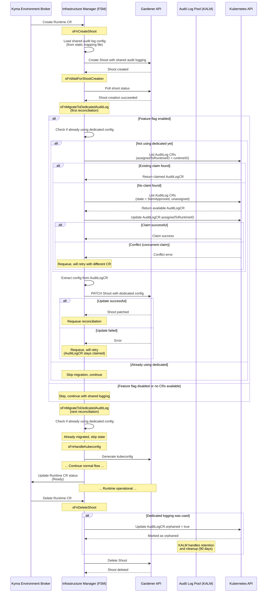

# Context

This document defines the architecture for integrating dedicated BTP audit logging infrastructure with Kyma Runtime provisioning via the Kyma Audit Log Manager (KALM).

# Status

Proposed

# Background

Currently, Kyma Runtimes use a shared audit logging infrastructure where multiple runtimes share common audit log tenants, configured via a static mapping file that maps provider type and region to tenant IDs. This approach has limitations:

- **No self-service access**: Users cannot directly access their audit logs without SRE assistance
- **Shared infrastructure**: Multiple runtimes share the same audit logging tenant
- **Static configuration**: Audit log configuration is managed via static file updates

The Kyma Audit Log Manager (KALM) introduces a pool-based approach for provisioning dedicated BTP audit logging infrastructure per runtime. KALM runs as part of the Kyma Control Plane and manages the complete lifecycle of dedicated audit log stacks through the `AuditLog` custom resource.

## KALM Pool Architecture

KALM maintains a pool of pre-provisioned `AuditLog` CRs in the `SiemApproved` state. These CRs contain:
- BTP subaccount with audit log service provisioned
- Service credentials stored in Gardener secrets
- SIEM registration completed
- Ready to be assigned to a Kyma Runtime

Key KALM states:
- `Pending`: Initial state, BTP resources being provisioned
- `RegistrationReady`: BTP resources ready, awaiting SIEM registration
- `SiemApproved`: In the pool, ready for assignment
- `Assigned`: Claimed by a runtime, in use
- `Orphaned`: Runtime deleted, in retention period (default: 90 days)

# Decision

## Architectural Approach

We implement a **two-phase provisioning model** where the Gardener shoot is created first with shared audit logging, then migrated to dedicated logging after successful shoot creation.

### FSM State Flow

```
sFnCreateShoot
    ↓
sFnWaitForShootCreation
    ↓
sFnMigrateToDedicatedAuditLog  (new state - inserted here)
    ↓
sFnHandleKubeconfig
    ↓
... (continue normal flow)
```

**Note**: After `sFnMigrateToDedicatedAuditLog` patches the shoot with dedicated config, it requeues the reconciliation. On the next reconciliation, the state will be skipped (because the shoot already has dedicated logging configured), and the flow continues to `sFnHandleKubeconfig`.

### Sequence Diagram



### Phase 1: Create Shoot with Shared Audit Logging

The `sFnCreateShoot` state creates the Gardener shoot using the existing shared audit log configuration from the static mapping file.

**Rationale**: Prevents wasted resources if shoot creation fails due to:
- Quota exceeded
- Invalid configuration
- Infrastructure provider issues
- Network configuration errors

### Phase 2: Migrate to Dedicated Audit Logging

After the shoot becomes ready, the `sFnMigrateToDedicatedAuditLog` state:

1. **Checks if already migrated**: Skip if shoot already uses dedicated logging
2. **Claims AuditLogCR** (idempotent):
   - Search for existing claim by RuntimeID
   - If not found, claim available AuditLogCR from pool
   - Set `AuditLog.Spec.AssignedToRuntimeID = runtimeID`
3. **Updates shoot configuration** (idempotent):
   - Patch shoot with audit log config from claimed AuditLogCR
   - Uses values from `AuditLog.Spec.Config.ServiceURL` and `AuditLog.Spec.Config.GardenerSecretName`

**Key Properties**:
- **Idempotent claim**: `findAuditLogCRByRuntimeID()` finds existing claim before creating new one
- **Idempotent update**: Shoot patch can be retried safely
- **Graceful degradation**: If no AuditLogCR available, runtime continues with shared logging
- **Optimistic concurrency**: Kubernetes resourceVersion prevents double-claiming

## Rejected Alternatives

### Alternative 1: Claim Before Shoot Creation

**Approach**: Claim AuditLogCR → Create shoot with dedicated config

**Rejected because**:
- If shoot creation fails (quota exceeded, invalid config), the claimed AuditLogCR is wasted
- The AuditLogCR remains locked to a non-existent runtime
- Pool resources are depleted unnecessarily
- Requires complex rollback logic

### Alternative 2: Claim and Create Atomically

**Approach**: Claim AuditLogCR and create shoot in a single transaction, with rollback on failure

**Rejected because**:
- Kubernetes doesn't support cross-resource transactions
- Rollback logic is complex and error-prone
- Shoot creation can fail at various stages (Gardener API, infrastructure provider)
- Still risks wasting resources during transient failures

### Alternative 3: Lock-Based Claiming

**Approach**: Add lock fields to AuditLog CR spec for claiming

**Rejected because**:
- Adds unnecessary complexity to the CRD
- Kubernetes optimistic concurrency (resourceVersion) already prevents double-claiming
- Locks can become stale if client crashes
- Requires lock cleanup/timeout logic

## Implementation Details

### AuditLog Data Provider

All audit log operations are abstracted behind the `auditlog.DataProvider` interface:

```go
type DataProvider interface {
    // Returns audit log data from dedicated or shared config
    GetAuditLogData(ctx, providerType, region, runtimeID, useDedicated) (AuditLogData, error)
    
    // Checks if runtime is using dedicated logging
    IsDedicated(ctx, runtimeID) (bool, error)
    
    // Releases dedicated AuditLogCR (marks as orphaned)
    ReleaseDedicated(ctx, runtimeID) error
}
```

**Benefits**:
- FSM doesn't need to know about claiming logic
- Easy to mock for testing
- Shared vs dedicated decision is encapsulated
- Graceful fallback to shared config is transparent

### Claiming Algorithm

```go
func getOrClaimAuditLogCR(ctx, runtimeID) (*AuditLog, error) {
    // Check if already claimed (idempotent)
    claimed := findAuditLogCRByRuntimeID(ctx, runtimeID)
    if claimed != nil {
        return claimed, nil
    }
    
    // Find available CR (state = SiemApproved, assignedToRuntimeID = "")
    available := findAvailableAuditLogCR(ctx)
    if available == nil {
        return nil, ErrNoAvailableAuditLog
    }
    
    // Claim it (optimistic concurrency via resourceVersion)
    available.Spec.AssignedToRuntimeID = runtimeID
    err := client.Update(ctx, available)
    if IsConflict(err) {
        // Another runtime claimed it concurrently, retry
        return nil, ErrConflictClaiming
    }
    
    return available, nil
}
```

**Key aspects**:
- **Idempotent**: Finding existing claim makes retries safe
- **Concurrent-safe**: Kubernetes resourceVersion prevents double-claiming
- **Failure-tolerant**: Conflict errors are expected and handled by retry

### Migration State Implementation

```go
func sFnMigrateToDedicatedAuditLog(ctx context.Context, m *fsm, s *systemState) (stateFn, *ctrl.Result, error) {
    if !m.RCCfg.DedicatedAuditLoggingEnabled {
        return sFnHandleKubeconfig, nil, nil // Feature flag disabled - skip
    }

    // Check if already using dedicated audit logging
    // This check ensures idempotency and prevents re-migration on subsequent reconciliations
    if isUsingDedicatedAuditLog(s.shoot) {
        m.log.Info("Already using dedicated audit logging, skipping migration")
        return sFnHandleKubeconfig, nil, nil
    }

    // Step 1: Get or claim AuditLogCR (idempotent)
    auditLogData, err := m.AuditLogDataProvider.GetAuditLogData(
        ctx,
        s.instance.Spec.Shoot.Provider.Type,
        s.instance.Spec.Shoot.Region,
        s.instance.GetName(),
        true, // use dedicated
    )
    if err != nil {
        // No available AuditLogCR - continue with shared logging
        m.log.Info("No available dedicated audit log, continuing with shared configuration",
            "error", err.Error())
        return sFnHandleKubeconfig, nil, nil
    }

    if !auditLogData.IsDedicated {
        // Provider fell back to shared config
        return sFnHandleKubeconfig, nil, nil
    }

    // Step 2: PATCH shoot with dedicated config (idempotent)
    if err := m.patchShootAuditLog(ctx, s.shoot, auditLogData); err != nil {
        // AuditLogCR is claimed, we'll retry the patch on next reconciliation
        m.log.Error(err, "Failed to patch shoot with dedicated audit log, will retry")
        return updateStatusAndRequeueAfter(m.RCCfg.GardenerRequeueDuration)
    }

    m.log.Info("Successfully patched shoot with dedicated audit logging",
        "runtimeID", s.instance.GetName())

    // Requeue to allow the shoot update to be processed
    // On next reconciliation, isUsingDedicatedAuditLog() will return true and we skip this state
    return updateStatusAndRequeueAfter(m.RCCfg.GardenerRequeueDuration)
}

// isUsingDedicatedAuditLog checks if the shoot is already configured with dedicated audit logging
// This prevents re-migration on subsequent reconciliations
func isUsingDedicatedAuditLog(shoot *gardener.Shoot) bool {
    if shoot == nil || shoot.Spec.Extensions == nil {
        return false
    }
    
    // Check if audit log extension contains dedicated config marker
    // (implementation details depend on how audit log config is stored in shoot spec)
    for _, ext := range shoot.Spec.Extensions {
        if ext.Type == "shoot-auditlog-service" {
            // Check if providerConfig contains dedicated audit log markers
            // e.g., check if secretName matches pattern for dedicated logs
            return isDedicatedAuditLogConfig(ext.ProviderConfig)
        }
    }
    return false
}
```

**Key behavior**:
- **First reconciliation after shoot creation**: State checks if already migrated (no), claims AuditLogCR, patches shoot, requeues
- **Second reconciliation**: State checks if already migrated (yes), skips immediately to `sFnHandleKubeconfig`
- **Subsequent reconciliations**: Same as second - always skips once migrated

### Cleanup on Runtime Deletion

When a runtime is deleted, the claimed AuditLogCR must be released:

```go
func sFnDeleteShoot(ctx, m *fsm, s *systemState) (stateFn, *ctrl.Result, error) {
    // Release the claimed AuditLogCR if we have one
    if m.RCCfg.DedicatedAuditLoggingEnabled {
        err := m.AuditLogDataProvider.ReleaseDedicated(ctx, s.instance.GetName())
        if err != nil {
            m.log.Error(err, "Failed to release dedicated audit log")
            // Continue with shoot deletion anyway
        }
    }
    
    // ... continue with shoot deletion ...
}
```

**ReleaseDedicated** marks the AuditLogCR as orphaned by setting `Spec.Orphaned = true`. KALM then:
1. Transitions the CR to `Orphaned` state
2. Maintains the audit logs for the retention period (default: 90 days)
3. Cleans up BTP resources after retention period expires

## Configuration Changes

### Feature Flag

A new feature flag controls dedicated audit logging:

```go
flag.BoolVar(&dedicatedAuditLoggingEnabled, 
    "dedicated-audit-logging-enabled", 
    false, 
    "Feature flag to enable dedicated BTP audit logging infrastructure for provisioned Kyma Runtime")
```

### FSM Configuration

```go
type RCCfg struct {
    // ... existing fields ...
    DedicatedAuditLoggingEnabled bool
    AuditLogDataProvider         auditlog.DataProvider
}
```

The `AuditLogDataProvider` replaces the direct use of `auditlogs.Configuration` map.

## Vendored AuditLog CRD

Since infrastructure-manager is in public GitHub and kyma-auditlog-manager is in internal SAP GitHub, the AuditLog CRD types are vendored:

```
pkg/auditlog/
└── v1beta1/
    ├── auditlog_types.go         # Vendored from KALM
    ├── zz_generated.deepcopy.go  # Vendored from KALM
    └── groupversion_info.go      # API metadata
```

**Maintenance**: When KALM updates the AuditLog CRD, these files must be re-synced.

## Error Handling and Edge Cases

### No Available AuditLogCR

**Scenario**: Pool is exhausted, no `SiemApproved` CRs available

**Handling**: 
- Log warning
- Continue with shared audit logging
- Runtime remains functional
- Next reconciliation retries

### Concurrent Claims

**Scenario**: Two runtimes try to claim the same AuditLogCR simultaneously

**Handling**:
- Kubernetes resourceVersion causes conflict error for second runtime
- Second runtime retries with different AuditLogCR from pool
- Eventually both runtimes get unique AuditLogCRs

### Shoot Update Failure

**Scenario**: Shoot patch operation fails after claiming AuditLogCR

**Handling**:
- AuditLogCR remains claimed with RuntimeID
- Next reconciliation finds existing claim (idempotent)
- Retries shoot update
- No duplicate claims, no resource waste

### Reconciliation Interrupted

**Scenario**: Controller crashes between claiming and updating shoot

**Handling**:
- Next reconciliation finds existing claim by RuntimeID
- Continues from where it left off
- Idempotent operations ensure correctness

### KALM Unavailable

**Scenario**: KALM controller is down or CRD not installed

**Handling**:
- List/Get operations fail
- Provider falls back to shared configuration
- Runtime continues to function normally

## Monitoring and Observability

Metrics to be implemented:

- `kim_dedicated_audit_log_claims_total` - Total claims attempted
- `kim_dedicated_audit_log_claims_success_total` - Successful claims
- `kim_dedicated_audit_log_claims_conflict_total` - Conflict errors (concurrent claims)
- `kim_dedicated_audit_log_pool_available` - Available AuditLogCRs in pool
- `kim_dedicated_audit_log_migration_duration_seconds` - Time to migrate shoot

Log events:
- Claim success/failure with RuntimeID
- Migration start/complete
- Fallback to shared configuration with reason
- Release on runtime deletion

# Consequences

## Positive

1. **No wasted resources**: Only claim AuditLogCR after shoot proves it can be created
2. **Idempotent operations**: Safe retries, no duplicate claims, recovery from interruptions
3. **Graceful degradation**: Runtimes continue working if dedicated logging unavailable
4. **Clean abstraction**: FSM doesn't need to know claiming details
5. **Concurrent-safe**: Optimistic concurrency prevents double-claiming
6. **Short migration window**: Runtimes use shared logging only briefly after creation

## Negative

1. **Brief shared logging period**: Runtime uses shared logging between creation and migration (typically <1 minute)
2. **Two-phase configuration**: Shoot configuration is updated post-creation
3. **Vendored CRD maintenance**: Must sync types when KALM updates AuditLog CRD
4. **Migration state complexity**: Additional FSM state increases controller logic

## Neutral

1. **Feature flag required**: Dedicated logging is opt-in via feature flag
2. **KALM dependency**: Requires KALM to be installed and maintaining pool
3. **Eventual consistency**: Migration happens asynchronously after shoot creation

# References

- [Kyma Audit Log Manager Repository](https://github.tools.sap/kyma/kyma-auditlog-manager)
- [KALM Architecture Documentation](https://github.tools.sap/kyma/kyma-auditlog-manager/docs/contributor/architecture)
- [Audit Log Package README](../../pkg/auditlog/README.md)
- [Infrastructure Manager Provisioning ADR](./001-provisioning.md)
